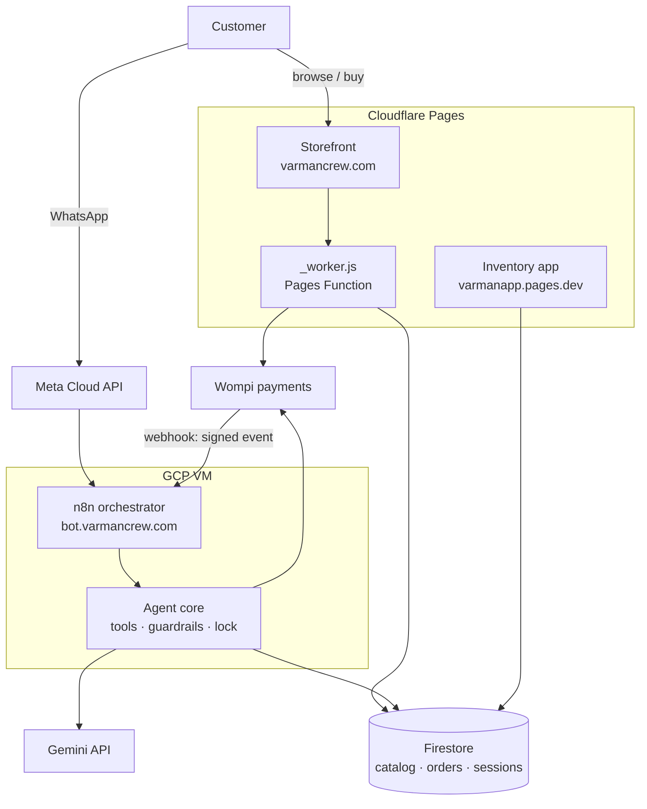

# VarMan Crew

Production e-commerce system for a Colombian sneaker retailer. Three services handling
real customers and real money: a storefront, an inventory app, and an LLM sales agent on
WhatsApp.

Live at [varmancrew.com](https://varmancrew.com). Built and operated by one person.

---

## Architecture



**Design rule that shapes everything:** the model makes things *probable*; code makes them
*certain*. Anything touching money or a promise to the customer — prices, order creation,
payment confirmation — is enforced in code, never left to the model.

---

## Unit economics

The agent runs against a metered API on a prepaid balance, so cost per conversation is a
first-class engineering constraint, not an afterthought.

| Metric | Measured |
|---|---|
| Tokens per model call | ~11,700 |
| System prompt share of that cost | **86%** (40,367 chars, sent in full on every call) |
| Calls per turn | 1.5 – 3 |
| Turns per conversation | ~6 (from 586 messages across 49 chats) |
| Cost per conversation | COP 500 – 1,000 |
| Average order value | COP 240,000 |

At roughly one sale per ten conversations, the agent costs ~COP 5,000–10,000 per sale
against a COP 240,000 order. The dominant lever is not the customer's message — it is the
static system prompt, which is identical on every call and therefore a candidate for
prompt caching or retrieval.

---

## Testing

Two harnesses, deliberately different.

**Offline harness — `bot_n8n/tests/test-cerebro-pipeline.js`** · 70 checks · runs in
seconds · costs nothing.

It runs the real agent core with Gemini and Firestore mocked. Each case *declares* what
the model would have answered (text and/or tool calls) and asserts what actually reaches
the customer. No API keys, no balance, and deterministic — unlike live testing, where
failures rotate because the model phrases things differently every run.

It was written after ~10 live-harness runs (~150 calls each, against a 40 KB prompt)
exhausted the prepaid API balance overnight and took the agent offline. It paid for
itself on the first run and caught bugs the expensive harness never saw, precisely
because the model rarely repeats the same mistake twice:

- A guardrail regex written to ban a filler phrase was also deleting an approved one —
  the customer gave their size and got no confirmation, at the moment of highest intent.
- On a price question, the model would invent a figure, the veto would correctly strike
  it, and the turn would ship with no price at all. Now code answers with the real
  catalog price.
- The anti-repetition ladder could exhaust itself and send the duplicate anyway.

**Structural guard (`P39`)** diffs the prompt against the code automatically — tools
named vs. tools declared, in both directions, plus session fields and enums. If a tool is
added to one side and not the other, it fails in seconds. Verified non-decorative by
planting a fake tool.

> **Method note:** a passing assertion is not enough. Three of the five most expensive
> bugs were found by dumping all 38 conversations and *reading* them, not by an assertion.

---

## Engineering notes

**Guarantee pipeline ordering.** With 14+ blocks rewriting the same response, the last
one wins — and guarantees sat in the middle, so a later truncation ate exactly what had
been guaranteed. The order is now explicit in code: *execute → rewrite → substitute the
question → guarantee*. New blocks go above the guarantees, never below.

**Distributed lock with TTL takeover.** A per-customer lock prevents double replies.
The first implementation used a Firestore `PATCH` with no precondition — which never
fails, so two runs could steal the same orphaned lock: the exact race the lock existed
to prevent. Atomicity in the Firestore REST API comes from `POST` with an explicit
`documentId` (409 on conflict) or `DELETE` with `currentDocument.updateTime`. The
releasing run must also prove ownership with a token, or it deletes someone else's lock.

**Timeouts must exceed the worst case.** A 45s wait guarding turns that can exceed 60s
reintroduces the race precisely on long turns — which are the high-intent ones.

**Never trust the client for price.** `_worker.js` reads the real price from the public
Firestore catalog on every purchase and validates each cart item independently. The
browser's number is ignored.

**Secrets never live in the repo.** `WOMPI_PRV_KEY` and `FIREBASE_SA_B64` are Cloudflare
environment variables, read at request time. In a static site any `PUBLIC_*` variable
ships inside the JavaScript every visitor downloads.

---

## Security

Five audit cycles, each committed with its findings:

| Cycle | Scope |
|---|---|
| A | Cumulative report across worker, bot and app |
| B | Web hardening — XSS, CSP, session and bot entry points |
| C | Infrastructure — Docker, GCP, n8n, backups |
| D | Live production verification — headers, API, webhook |
| E | Dependency CVEs verified; n8n patched to 2.28.6 |

Plus Firestore rules hardened to membership-by-email-list, and a semantic HTML / a11y
audit (heading hierarchy, 44px touch targets).

Payment confirmation is never taken from the browser. It arrives as a signed Wompi
webhook, verified server-side, matched to the order by `wompi_payment_link_id`.

---

## Stack

**Frontend** — static HTML with GSAP/ScrollTrigger; React inventory app (photo-based sales
scanning via a vision API)
**Edge** — Cloudflare Pages + Pages Functions
**Agent** — n8n on a GCP VM, Gemini, Meta WhatsApp Cloud API
**Data** — Firestore
**Payments** — Wompi (payment links + signed webhooks)

---

## Repository layout

```
web/publicar/       storefront + _worker.js (purchase endpoint)
web/pruebas-wompi/  payment sandbox harness
app/                React inventory app
bot_n8n/
  workflows/src/    agent core, guardrails, webhook handlers
  tests/            offline (free) and live (paid) harnesses
  briefs/           frozen contracts — order schema
seguridad/          audit reports
```

---

> Commit history before `c2416e4` is in Spanish; later commits are in English. History is
> not rewritten.
